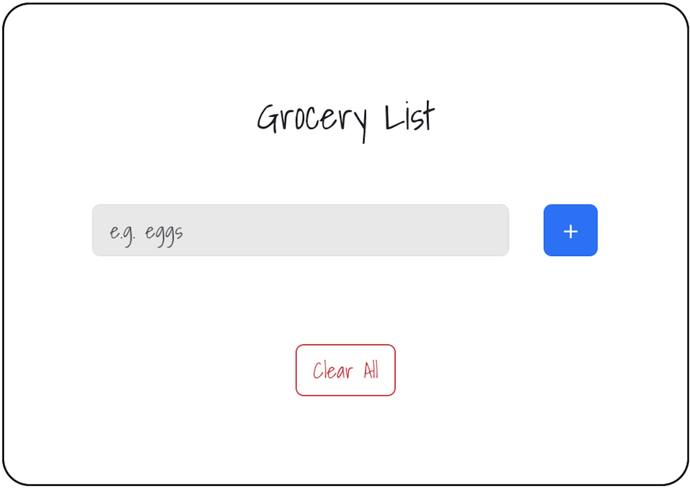

# Grocery List App
A grocery list app to organise list of items to buy at the grocery shop.

Click this link for a live demo: [Grocery-List-App](https://main.du85u0nlbn4bw.amplifyapp.com/)

## Overview
**Tech Used:** React.js, Javascript, HTML, CSS, Bootstrap

This Grocery List App allows users to input items which are then stored and displayed as a list. Users can add, edit or delete items on the list and also have the option to clear the entire list. Each item can also be checked off by clicking the checkbox beside it.

## Lessons learned
- Use the spread operator `...groceryList` to create shallow copy of grocery list, then append new grocery item to the list.
- Define objects in grocery list using `{name: myInput.current.value, selected: false}`. 'name' can then be referenced as the item that is inputted and 'selected' is whether the checkbox has been checked or not.
